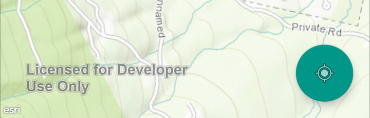
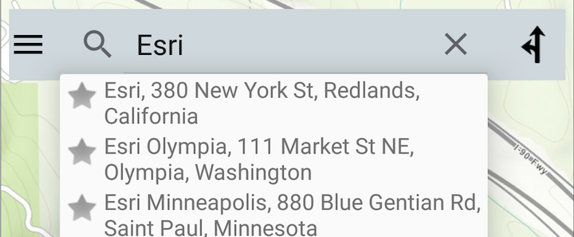
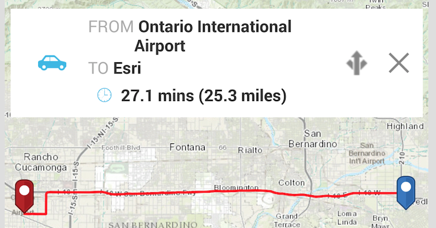

Maps-App
==================
The Maps-App for Android 

Read developer setup instructions [here](https://github.com/Esri/maps-app-android/blob/master/README.md). 

## Features

### My Location
See your location on the map

### Place search
Search for addresses, points of interests, administrative place names, postal codes, or x/y coordinates.  

### Driving Directions
Generate turn-by-turn directions between two places with distance and estimated drive time.  

### Switch basemaps
Choose from a wide range of basemaps including Streets, Topography, World Imagery, etc.  

### Measure tool
Calculate distance or area in multiple units that are extendible.  

### Sign into ArcGIS
Sign into your ArcGIS account to add custom maps from your organization.
