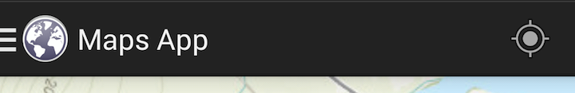
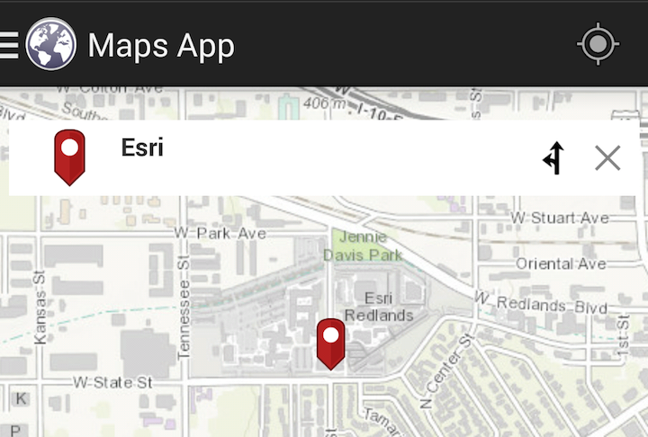
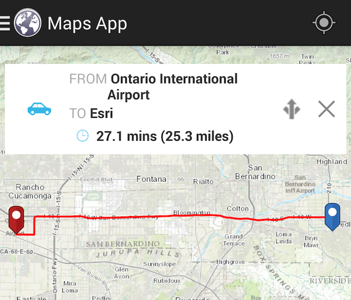
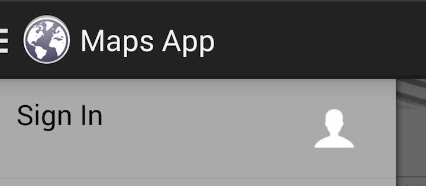

Maps-App
==================
The Maps-App for Android 

Read developer setup instructions [here](https://github.com/Esri/maps-app-android/blob/master/README.md). 

## Features

### My Location
See your location on the map

Turn on your device's gps and launch the app! If you browse on the map and would like to go back to your location tap the gps icon located in the top-right corner.

### Place search
Search for addresses, points of interests, administrative place names, postal codes, or x/y coordinates.  

Long press on the map to get the adress of that point or you can simply search for a place on map by typing in address, postal code, x/y coordinates, place name. The result will be highlighted on the map.

### Driving Directions
Generate turn-by-turn directions between two places with distance and estimated drive time.  

You can use the result of **Place Search** to get the route from your location to your destination by simply tapping on  . To get detailed driving directions just tap on  to get turn by turn instructions.
 
If you want to search for a route from 'Location A' to 'Location B', you can tap on the  icon in the search bar. 
 
Enter your Location and tap on **Get Route** to see the driving directions from one location to another. 

### Switch basemaps
Choose from a wide range of basemaps including Streets, Topography, World Imagery, etc.  

You can switch the basemaps by swiping left from the edge of your device and selecting **Switch Basemap** from the options.

### Sign into ArcGIS
Sign into your ArcGIS account to add custom maps from your organization.

