Maps-App
==================
The Maps-App for Android 

Read developer setup instructions [here](https://github.com/Esri/maps-app-android/blob/master/README.md). 

## Features

### My Location
See your location on the map

Turn on your device's gps and launch the app! If you browse on the map and would like to go back to your location tap the GPS floating action button located in the bottom-right corner.

![] (assets/home.png)

### Place search
Search for addresses, points of interests, administrative place names, postal codes, or x/y coordinates.  As you type, the app will provide hints in the search box.

![] (assets/hints.png)

Choosing one of the search hints will show the location in the map with a red symbol marker.

Long press on the map to get the adress of that point and a magnifier will be displayed to help pinpoint your desired target location. The result will be highlighted on the map.

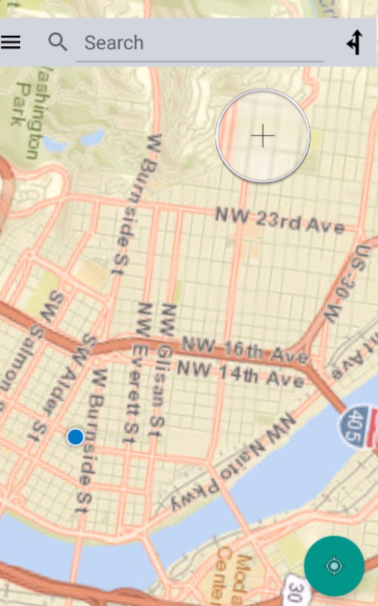

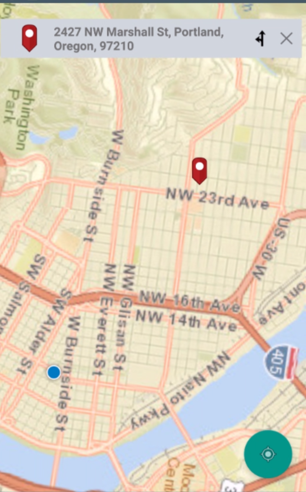

### Routing
Routing requires requires credits and will require you to login into your organization's ArcGIS Online account. After searching for a location, the route to it from your current location can be mapped by pressing the routing icon to the right of the search box.  You'll be prompted for authentication credentials the first time your ask for a route.

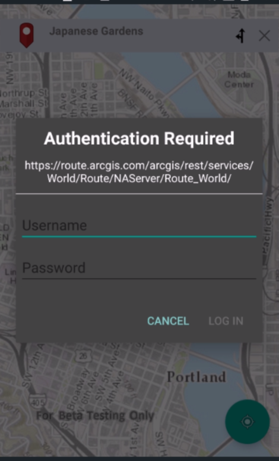

The route is shown with travel time and distance in meters.  

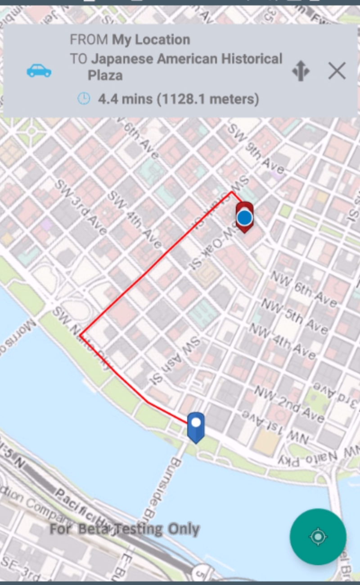

Tapping on the three-headed arrow in the route result dialog will display driving directions.

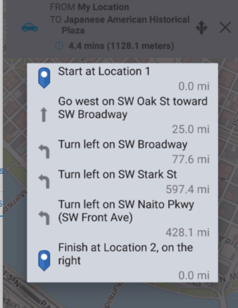

To clear the route, tap the 'X' in the route result dialog.  You can route between any two locations by clicking the route icon without having first searched for a location.  This will bring up a routing dialog where you can either use your current location as the origin or type in another address.  Type in the address of your destination and click 'Get Route'.

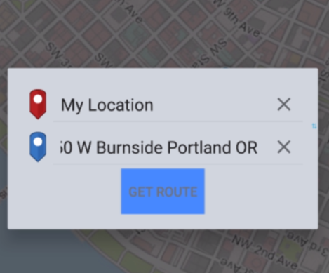

### Switch basemaps
Choose from a wide range of basemaps including Streets, Topography, World Imagery, etc.  

You can switch the basemaps by swiping left from the edge of your device and selecting **Switch Basemap** from the options.

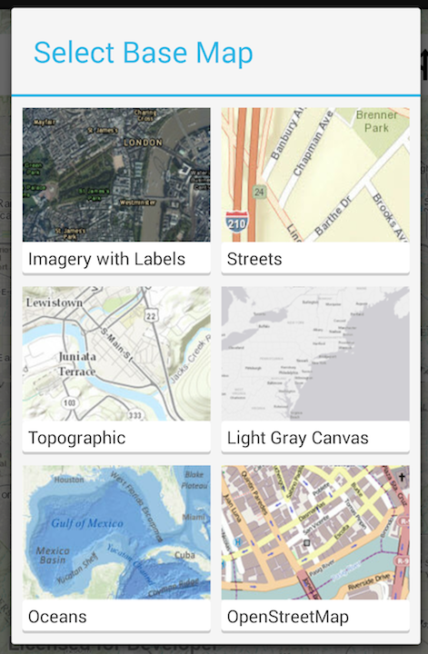

### Sign into ArcGIS
Tap on the drawer to sign into your ArcGIS account where you can view custom maps from your organization.

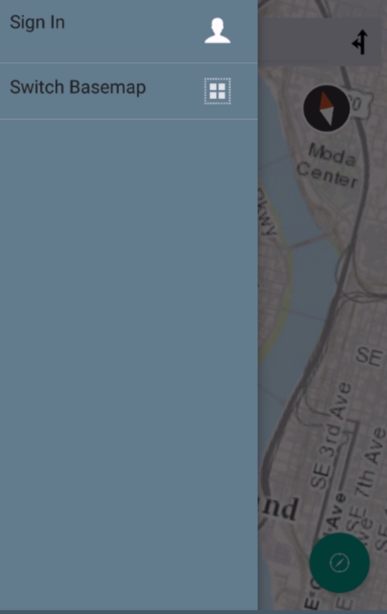

Tapping the Sign In will launch a URL navigator where you can enter your organization's ArcGIS Online URL.

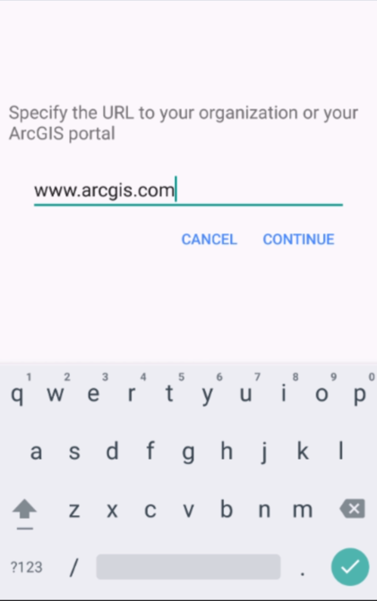

You'll be prompted for credentials....

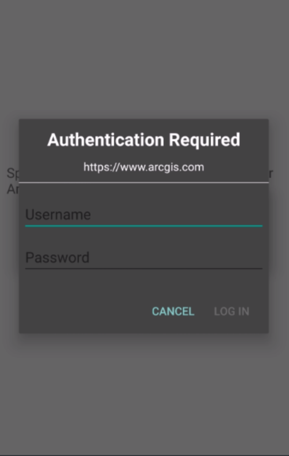

Once authenticated, you'll see a number of portal items that can be loaded in to the Map-app.  

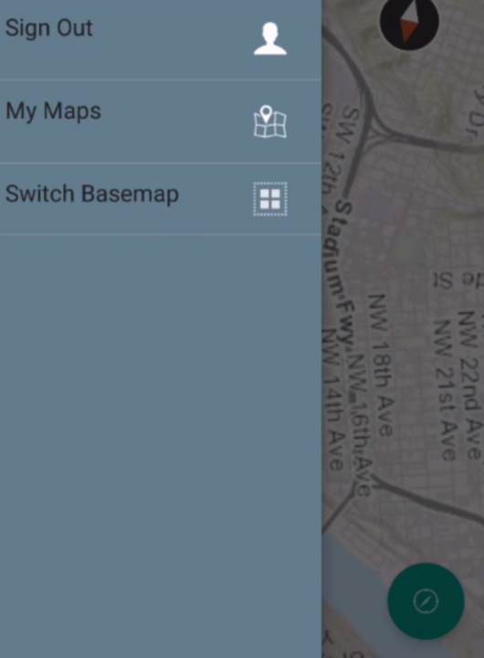

If you have any web maps in your portal, they will be shown in the list view after clicking on 'My Maps'.  You may also have additional basemaps to choose from.

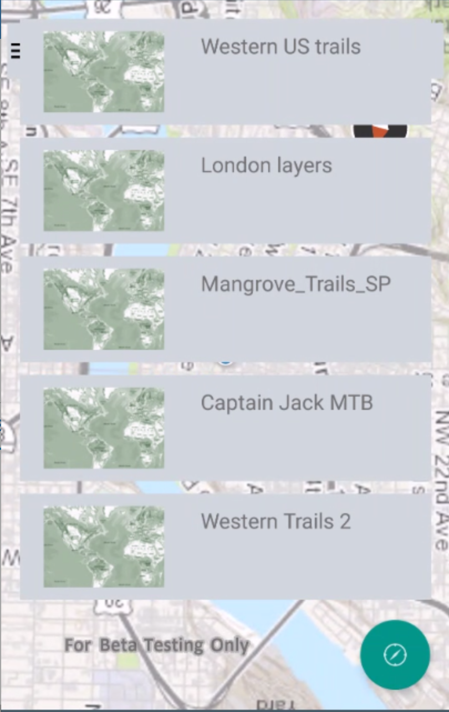

